---
title:
subtitle: 
author:
date:
output:
  html_document:
    toc: false
    toc_float: true 
    depth: 2
    number_sections: false
    theme: spacelab
    highlight: pygments
editor_options: 
  markdown: 
    wrap: 150
---

```{css, echo = FALSE}
/* styles.css */

.text-toggle button {
  background-color: #009bff;
  color: #fff;
  border: none;
  padding: 5px 10px;
  border-radius: 5px;
  cursor: pointer;
}

.text-toggle button:hover {
  background-color: #0076b3;
}

#hidden-text {
  display: none;
}
```

<script>
function toggleText() {
  var x = document.getElementById("hidden-text");
  if (x.style.display === "none") {
    x.style.display = "block";
  } else {
    x.style.display = "none";
  }
}
</script>

```{r, echo=FALSE}
htmltools::img(src =knitr::image_uri('images/banner1.png'),
               alt = 'logo', 
               style = 'position:center; top:0; left:0; padding:0px;')
```

------------------------------------------------------------------------------------------------------------------------------------------------------

# SEA Shark and Ray Research and Conservation Workshop {.tabset .tabset-fade}

<br>

## Introductions

::: {style="display: grid; grid-template-columns: 2fr 1fr; grid-column-gap: 60px;"}
<div>

### Who am I?

<br>

**Vinay** is a Research Scientist at the [Australian Institute of Marine Science](https://www.aims.gov.au/). He is an ecologist that is particularly
interested in using spatio-temporal datasets to understand animal movements and distributions patterns. He has considerable experience using **R** to
analyse and visualise large and complex spatial datasets. He has developed **R** code and packages to analyse 2 and 3 dimensional movement patterns of
animals using acoustic telemetry data from single study sites to continental scale arrays. Vinay's **R** codes can be found on his [github
page](https://github.com/vinayudyawer).

</div>

<div>


</div>
:::

------------------------------------------------------------------------------------------------------------------------------------------------------

### Course outline

**In this course you will learn about different ways to analyse and interpret your aquatic telemetry datasets using R**. This workshop will
demonstrate how **R** can make the processing of spatial data much quicker and easier than using standard GIS software! At the end of this workshop
you will also have the annotated **R** code that you can re-run at any time, share with collaborators and build on with those newly acquired data!

I designed this course not to comprehensively cover all the tools in **R**, but rather to give you an understanding of options on how to analyse your
telemetry data (both from satellite and acoustic tags). Every new project comes with its own problems and questions and you will need to be
independent, patient and creative to solve these challenges. It makes sense to invest time in becoming familiar with **R**, because today **R** is the
leading platform for environmental data analysis and has some other functionalities which may surprise you!

<br>

This **R** workshop is intended to run across 3 sessions.

<br>

-   **Session 1:** *Getting familiar with R and spatial data*

1.  **Import** and **explore** datasets [*tidyverse*](http://tidyverse.org/)
2.  Working with **Spatial objects** using [*sf*](https://r-spatial.github.io/sf/), [*ggspatial*](https://paleolimbot.github.io/ggspatial/) and
    [*mapview*](https://r-spatial.github.io/mapview/)

<br>

-   **Session 2:** *Working with satellite telemetry data*

1.  Understanding the data structure from **satellite tags**
2.  **Processing** and **visualising** satellite tag data using the [*aniMotum*](https://github.com/ianjonsen/aniMotum) package

<br>

-   **Session 3:** *Working with passive acoustic telemetry data*

1.  Understanding the data structure from **acoustic telemetry data**
2.  Using the [*VTrack*](http://github.com/rossdwyer/VTrack) R package to explore patterns in animal detections and dispersal
3.  Using the [*re**mo**ra*](https://github.com/IMOS-AnimalTracking/remora) R package to interactively explore your telemetry data

------------------------------------------------------------------------------------------------------------------------------------------------------

<style>
div.blue { background-color:#e6f0ff; border-radius: 5px; padding: 20px;}
</style>
<div class = "blue">

### Course Resources

The course resources will be emailed to you prior to the workshop. However, you can also access the data and scripts we will work through in this
course following these steps:

**1. Download the course materials from [this link](https://github.com/vinayudyawer/SEA-workshop2023/raw/main/data/SEA-Workshop-2023.zip).**

**2. Unzip the downloaded file. It should have the following two folders and a html file:**

- [***Code***]{style="color:darkblue"} *folder*
- [***Data***]{style="color:darkblue"} *folder*
- [***SEA-workshop2023.html***]{style="color:darkblue"} *file*

**3. Save all the files in a location on your computer you can find again during the workshop**
    
</div>

------------------------------------------------------------------------------------------------------------------------------------------------------

<a href="#top" style="color:steelblue; font:bold;" >Back to top</a>

<br><br>

## Software installation

<br>

Processing and analysing large datasets like those from animal telemetry work can require a huge investment in time: rearranging data, removing
erroneous values, purchasing, downloading and learning the new software, and running analyses. Furthermore merging together Excel spreadsheets,
filtering data and preparing data for statistical analyses and plotting in different software packages can introduce all sorts of errors.

**R** is a powerful language for data wrangling and analysis because...

-   It is relatively *fast* to run and process commands
-   You can create *repeatable* scripts
-   You can *trace errors* back to their source
-   You can *share your scripts* with other people
-   It is *easy to identify errors* in large data sets
-   Having your data in **R** opens up a huge array of cutting edge analysis tools.
-   **R** is also totally **FREE!**

<br>

**Installing packages**

Part of the reason **R** has become so popular is the vast array of packages that are freely available and highly accessible. In the last few years,
the number of packages has grown exponentially [\> 10,000 on CRAN!](http://blog.revolutionanalytics.com/2017/01/cran-10000.html) These can help you to
do a galaxy of different things in **R**, including *running complex analyses*, drawing *beautiful figures*, running *R as a GIS*, constructing your
own *R packages*, building *web pages* and even *writing R course handbooks* like this one!

Let's suppose you want to load the `sf` package to access this package's incredible spatial functionality. If this package is not already installed on
your machine, you can download it from the web by using the following command in **R**.

```{r, include=TRUE, eval=FALSE, class.source = 'fold-show'}
install.packages("sf", repos='http://cran.us.r-project.org')
```

In this example, `sf` is the package to be downloaded and '<http://cran.us.r-project.org>' is the repository where the package will be accessed from.

<br>

More recently, package developers have also used other platforms like [**GitHub**](https://github.com) to house **R** packages. This has enabled users
to access packages that are actively being updated and enable developers to fix problems and develop new features with user feedback.

The `remotes` and `devtools` **R** packages have enabled the installation of packages directly from platforms like **GitHub**. For example, if we want
want to download the `VTrack` package from the github repository, we can use the `install_github()` package to do it like this:

```{r, include=TRUE, eval=FALSE, class.source = 'fold-show'}
remotes::install_github("rossdwyer/VTrack")
```


------------------------------------------------------------------------------------------------------------------------------------------------------

<style>
div.blue { background-color:#e6f0ff; border-radius: 5px; padding: 20px;}
</style>
<div class = "blue">

### Installation instructions:

For this course, make sure you have downloaded and installed the most updated versions of the following software:

<br>

**1. Download R for your relevant operating system from the [CRAN website](https://cran.rstudio.com)** <br>

**2. Download RStudio for your relevant operating system from the [RStudio website](https://posit.co/products/open-source/rstudio/)** <br>

**3. Once you've installed the above software, make sure you install the following packages prior to the start of the course**

```{r, include=TRUE, eval=FALSE, class.source = 'fold-show'}
## Packages that are on CRAN

install.packages(c("tidyverse",
                   "sf",
                   "ggspatial",
                   "leaflet",
                   "remotes"))

## Install packages from GitHub and other external repositories

remotes::install_github("r-spatial/mapview", build_vignettes = TRUE)
remotes::install_github("rossdwyer/VTrack", build_vignettes = TRUE)
remotes::install_github('IMOS-AnimalTracking/remora', build_vignettes = TRUE)
install.packages("aniMotum", 
                 repos = c("https://cloud.r-project.org",
                 "https://ianjonsen.r-universe.dev"),
                 dependencies = TRUE)

```

When downloading from **GitHub**, the R console will ask you if it should also update packages. In most cases, you can skip updating packages (**option [3]**)
as this often stalls the whole process of downloading the package. If there are package dependencies, these will often be downloaded automatically (but not
always!). If you want to update the packages you have, you can do it separately.

</div>

------------------------------------------------------------------------------------------------------------------------------------------------------

<a href="#top" style="color:steelblue; font:bold;" >Back to top</a>

<br><br>

## Session 1

### Getting familiar with R and spatial data {.tabset .tabset-fade}

|                          |
|:-------------------------|
| 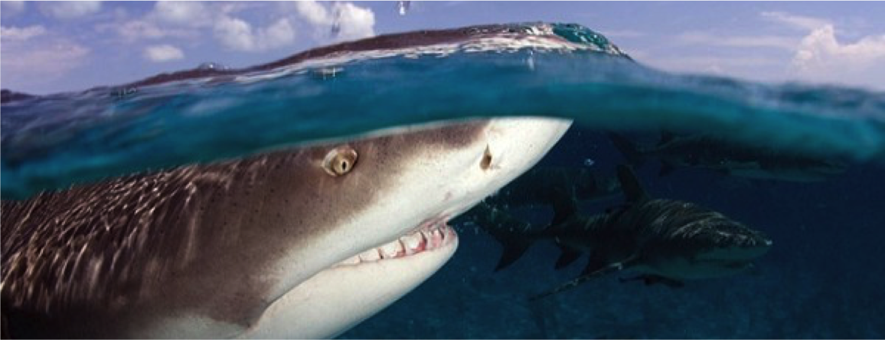 |

<br>

The process of turning raw data into publishable results is a highly involved, particularly with telemetry studies. Tracking data sets are becoming 
larger, and larger as they are being gathered over longer time periods, over larger spatial extents and at increasing temporal resolutions. While this
is increasing our ability to detect subtle patterns, these data sets are becoming vast and require analytical tools that easily handle, manipulate and 
visualise these complex datasets.

In this session we are going to work with a data set containing detection data from 3 Australian Blacktip Sharks (*Carcharhinus tilstoni*) shown in
the image above. These animals were captured and tagged in Townsville, Australia roughly one month prior to the landfall of Cyclone Yasi in
2011. Blacktip sharks were tracked using a network of acoustic hydrophones deployed in a grid pattern on the East and West side of Cleveland Bay.

Telemetry data from these sharks were analysed alongside 45 others from five species to examine movement patterns of coastal sharks before, during and
after three extreme weather events in Australia (Cyclone Yasi and Tropical Storm Anthony, 2011) and the US (Tropical Storm Gabrielle, 2001). You can
read more about that study [here](http://www.int-res.com/abstracts/meps/v480/p171-183/).

<br>

[**You can download the datasets we will use for this session from [here](https://github.com/vinayudyawer/SEA-workshop2023/raw/main/data/Session%201.zip).**]{style="color:firebrick"}
[**The link should download a zip file with two .csv files that we will use during this session.**]{style="color:firebrick"}

<br>

```{r, echo=FALSE, message=FALSE, include=TRUE, out.width = '100%'}

library(tidyverse)
library(mapview)
library(leaflet)
library(sf) 

# Import datasets
blacktip <- read_csv('Data/Session 1/Blacktip_ClevelandBay.csv')
statinfo <- read_csv('Data/Session 1/Station_information.csv')

cb <- 
  statinfo %>% 
  filter(installation %in% "Cleveland Bay") %>% 
  group_by(station_name, longitude, latitude) %>% 
  summarise(num_rec = n()) %>% 
  st_as_sf(coords = c("longitude", "latitude"), crs = 4326, remove = F)

bt <-
  blacktip %>% 
  group_by(transmitter_name, station_name, longitude, latitude) %>% 
  summarise(num_det = n()) %>% 
  st_as_sf(coords = c("longitude", "latitude"), crs = 4326)

m <- 
    mapview(cb, alpha.reg = 0, alpha = 1, color = "grey", map.types = "Esri.WorldImagery", legend = F, homebutton = F, cex = 5) +
    mapview(bt, zcol = "transmitter_name", burst = T, legend = F, homebutton = F, alpha = 0, alpha.reg = 1, cex = 5)

m@map %>% 
    addLayersControl(
        #baseGroups = c("Map","Satellite"),
        baseGroups = unique(blacktip$transmitter_name),
        options = layersControlOptions(collapsed = FALSE)) %>%
  setView(lng = 146.90097, lat = -19.20836, zoom = 11) %>% 
  hideGroup(unique(blacktip$transmitter_name))

```

The web map of detection data we will explore by the end of **Session 1**.

Click on the tabs below to progress through the first session. Lets start with exploring datasets using **tidyverse**:

<a id="session1"></a>

<br>

#### Import and explore datasets using the ***tidyverse***

<br>

Before we can analyse these data, we first need to read this dataset into R. The 'comma sperated value' (.csv) format is a popular and effective
way to export large datasets. This format is a prefered way to store your data, and easily import into R. A .csv file can simply be imported into 
**R** using the `read.csv` base function, and by telling R where the file is located on your computer.

```{r, eval = FALSE, class.source = 'fold-show'}
# Load the blacktip shark data using base read.csv function
blacktip <- read.csv('location_of_csv_file/Session 1/Blacktip_ClevelandBay.csv', header = TRUE)
```

<br>

<style>
div.blue { background-color:#e6f0ff; border-radius: 5px; padding: 20px;}
</style>
<div class = "blue">

**A note about Excel files**

Don't use '.xlsx' or '.xls' files for saving data. The problem with '.xls' and '.xlsx' files are that they store extra info with the data that makes
files larger than necessary and Excel formats can also unwittingly reformat or alter your data!

A stable way to save your data is as a '.csv' file. These are simply values separated by 'commas' and rows defined by 'returns'. If you select 'Save
as' in Excel, you can choose '.csv' as one of the options. If you open the .csv file provided in the 'Data' folder using a text editor, you will see
it is just words, numbers and commas.

</div>

<br><br>

<center>

</center>

<br>

***What is the tidyverse?***

The [tidyverse](http://tidyverse.org/) is the collective name given to suite of **R** packages designed mostly by Hadley Wickham. This is becoming an
increasingly popular set of packages that share an underlying design philosophy, grammar, and data structure. You can learn more about all the
features of these packages from the free online course developed by the package creators [here](https://r4ds.hadley.nz).

<br>

***Members of the tidyverse***

readr, broom, **dplyr**, **forcats**, **ggplot2**, haven, httr, hms, jsonlite, lubridate, magrittr, modelr, **purrr**, **readr**, readxl, **stringr**,
**tibble**, rvest, **tidyr**, xml2

The advantage of the `tidyverse` is that most of these packages (but not all!) can be loaded simultaneously using a single line of code

```{r setup, message=FALSE, class.source = 'fold-show'}
library(tidyverse)
```

<br>

The `tidyverse` version of the above code will be `read_csv()` function. The main difference being the data imported as a `tibble` data frame. The
advantage of a `tibble` database is that all the columns will be formatted correctly, with the package guessing what the best format may be.

```{r, message=FALSE, class.source = 'fold-show'}
blacktip <- read_csv('data/Session 1/Blacktip_ClevelandBay.csv')

# You can also use read_csv to input data directly from a website URL
blacktip <- 
  read_csv('https://raw.githubusercontent.com/vinayudyawer/SEA-workshop2023/main/data/Session%201/Blacktip_ClevelandBay.csv')

head(blacktip)
```

<br>

**Pipes `%>%`**

<center>

</center>

<br>

Now that we've successfully loaded in our tracking dataset, lets start having a closer look at the data using pipes `%>%`

-   Originally from the `magrittr` package but has been imported to the `tidyverse`.
-   `%>%` is an **infix operator**. This means it takes two operands, left and right.
-   'Pipes' the **output** of the last expression/function (left) forward to the **first input** of the next funciton (right).

```{r, eval = FALSE, class.source = 'fold-show'}
# For example, to see what class our data is in, we could use this code...
class(blacktip)

# Alternatively in the tidyverse we could use this code...
blacktip %>% class()
```

<br>

***Benefits of pipes %\>%***

-   Functions flow in natural order that tells story about data.
-   Code effects are easy to reason about by inserting `View()` or `head()` into pipe chain.
-   Common style makes it easy to understand collaborator (or your own) code.

We can have a quick look at the data by typing:

```{r, eval = FALSE, class.source = 'fold-show'}
# Now insert functions into the pipe chain
blacktip %>% View()
blacktip %>% head() # first 6 rows by default
blacktip %>% tail(10) # specify we want to look at the last 10 rows
```

This functionality is particularly useful if the data is very large!

Note the `()`, as opposed to the `[]` we used for indexing. The `()` signify a *function*.

We can look at the data more closely using the `nrow()`, `ncol()`, `length()`, `unique()`, `str()` and `summary()` functions.

```{r, eval=FALSE, class.source = 'fold-show'}
blacktip %>% nrow() # number of rows in the data frame
blacktip %>% ncol() # number of columns in the data frame
blacktip %>% str() # provides internal structure of an R object
blacktip %>% summary() # provides result summary of the data frame
```

```{r, eval=TRUE, results='hide', class.source = 'fold-show'}
# pipes can be used for single column within data frames
blacktip$transmitter_name <-
  blacktip$transmitter_name %>% as.factor()

# pipes are used to conduct multiple functions on the dataset in a certain order
blacktip %>% 
  subset(transmitter_name == "Colin") %>% # subset dataset to include only detections by 'Colin'
  nrow() # number of rows (i.e. detections) from 'Colin'
```

Pipes can also be used to pre-process our data before plotting them. Lets now use pipes to plot a simple barplot of the number of Colins detections at
each reciever.

```{r, eval=TRUE, class.source = 'fold-show', fig.align = 'center'}
blacktip %>% 
  subset(transmitter_name == "Colin") %>% # subset dataset to include only detections by 'Colin'
  with(table(station_name)) %>% # create a table with the number of rows (i.e. detections) per receiver
  barplot(las = 2, xlab = "Receiver station", ylab = "Number of Detections") # barplot of number of Colin's detections recorded per receiver
```

<br>

**`dplyr`**

-   `dplyr` is the data wrangling workhorse of the tidyverse.
-   Provides functions, **verbs**, that can manipulate data into the shape you need for analysis.
-   Has many backends allowing `dplyr` code to work on data stored in SQL databases and big data clusters.
-   Works via translation to SQL. Keep an eye out for the SQL flavour in `dplyr`

***Basic vocabulary***

-   `select()` columns from a tibble
-   `filter()` to rows matching a certain condition
-   `arrange()` rows in order
-   `mutate()` a tibble by changing or adding rows
-   `group_by()` a variable
-   `summarise()` data over a group using a function

Check out this useful online
[cheatsheet](https://rstudio.github.io/cheatsheets/html/data-transformation.html?_gl=1*1osjb37*_ga*OTE3OTY4MTUzLjE2OTMyODk4OTM.*_ga_2C0WZ1JHG0*MTY5MzQ1NDM4NS4yLjAuMTY5MzQ1NDM4NS4wLjAuMA..)
for data wrangling.

<br>

**`select`**

We can use the `select` function in `dplyr` to choose the columns we want to include for our analyses and plotting

```{r, class.source = 'fold-show'}
# Select the rows we are interested in
blacktip <- 
  blacktip %>% 
  select(date_time, latitude, longitude, receiver, station_name, transmitter_name, transmitter, sensor_value) %>% # columns we want to include
  select(-sensor_value) # the minus symbol denotes columns we want to drop

head(blacktip)
```

<br>

**`filter` and `arrange`**

We can use these functions to **subset the data** to rows matching logical conditions and then **arrange according to particular attributes**

```{r, eval=FALSE, class.source = 'fold-show'}
blacktip %>%
  filter(transmitter_name == "Ana") %>%
  arrange(date_time) # arrange Ana's detections in chronological order

blacktip %>%
  filter(transmitter_name == "Bruce") %>%
  arrange(desc(date_time)) # arrange Bruce's detections in descending chronological order
```

<br>

**`group_by` and `summarise`**

Determine the total number of detections for each tagged shark

```{r, eval=FALSE, class.source = 'fold-show'}
blacktip %>%
  group_by(transmitter_name) %>%
  summarise(NumDetections = n()) # summarise number of detections per tagged shark

blacktip %>%
  group_by(transmitter_name, station_name) %>%
  summarise(NumDetections = n()) # summarise number of detections per shark at each receiver
```

<br>

**`mutate`**

Adding and removing data to the data frame through a pipe

```{r, class.source = 'fold-show'}
blacktip <- 
  blacktip %>%
  mutate(date = as.Date(date_time)) %>% # adding a column to the blacktip data with date of each detection
  mutate(transmitter = NULL) # removing the `Transmitter` column

head(blacktip)
```

<br>

**`lubridate`**

-   `lubridate` is an easy way to convert date and time data into a form that **R** can recognise
-   Allows for calculation of durations and intervals between dates.
-   Recognises multiple date time formats and parses them to a standardised 'POSIX' format that **R** uses (`ymd` for dates; `ymd_hms` for date and
    time parsing)
-   These features are very important when working with spatio-temporal datasets like telemetry data

Currently in our `blacktip` dataset the "date_time" column is in the Universal Coordinated Time Zone (UTC). Let's use `lubridate` to convert this
column into the 'POSIX' format and into the local date time (i.e. UTC + 10 hours).

```{r, eval=TRUE, message=FALSE, class.source = 'fold-show'}
library(lubridate)

blacktip <-
  blacktip %>% 
  mutate(local_date_time = with_tz(date_time, tzone = "Australia/Brisbane")) %>% # convert to local "Australia/Brisbane" date time (UTC + 10hrs)
  mutate(date = date(local_date_time)) # use lubridate to update local date time into a date field

```

<br>

**Data visualisation using `ggplot2`**

`ggplot2` is a powerful data visualization package for the **R** programming language. The package makes it very easy to generate some very impressive
figures and utilise a range of colour palettes, taking care of many of the fiddly details that can make plotting graphs in **R** a hassle.

The system provides **mappings** from your data to **aesthetics** which are used to construct beautiful plots.

Documentation for `ggplot2` can be found [here](https://ggplot2.tidyverse.org).

There is also this awesome
[cheetsheet](https://rstudio.github.io/cheatsheets/html/data-visualization.html?_gl=1*hd7s9e*_ga*OTE3OTY4MTUzLjE2OTMyODk4OTM.*_ga_2C0WZ1JHG0*MTY5MzQ1NDM4NS4yLjAuMTY5MzQ1NDM4NS4wLjAuMA..)
for `ggplot2`

<br>

<style>
div.blue { background-color:#e6f0ff; border-radius: 5px; padding: 20px;}
</style>
<div class = "blue">

***`ggplot2` grammar***

The basic idea: independently specify plot building blocks and combine them to create just about any kind of graphical display you want.

Building blocks of a graph include:

-   data
-   aesthetic mapping
-   geometric object
-   statistical transformations
-   scales
-   coordinate system
-   position adjustments
-   faceting

***Aesthetic Mapping***

In `ggplot2`, aesthetic means "something you can see". Aesthetic mapping (i.e., with `aes()`) only says that a variable should be mapped to an
aesthetic. It doesn't say how that should happen. For example, when mapping a variable to shape with `aes(shape = x)` you don't say what shapes should
be used. Similarly, `aes(color = z)` doesn't say what colors should be used. Describing what colors/shapes/sizes etc. to use is done by modifying the
corresponding scale.

In `ggplot2` scales include:

-   `position` (i.e., on the x and y axes)
-   `color` ("outside" color)
-   `fill` ("inside" color)
-   `shape` (of points)
-   `linetype`
-   `size`

Each type of geom accepts only a subset of all aesthetics--refer to the geom help pages to see what mappings each geom accepts. Aesthetic mappings are
set with the `aes()` function.

<br>

***Geometic Objects (geom)***

Geometric objects are the actual marks we put on a plot. Examples include:

-   points (`geom_point`, for scatter plots, dot plots, etc)
-   lines (`geom_line`, for time series, trend lines, etc)
-   boxplot (`geom_boxplot`, for, well, boxplots!) A plot must have at least one geom; there is no upper limit. You can add a geom to a plot using the
    `+` operator

You can get a list of available geometric objects using the code below:

```{r, eval = FALSE, class.source = 'fold-show'}
help.search("geom_", package = "ggplot2")
```

</div>

<br>

In the below script we call the data set we have just made (`blacktip`) and then pipe it into the `ggplot()` function. We than tell ggplot that we
want to plot a box plot.

```{r, class.source = 'fold-show', fig.align = 'center', message=FALSE}
library(ggplot2)   

blacktip %>%
  group_by(transmitter_name, date) %>% 
  summarise(daily_detections = n()) %>% # use summarise to calculate numbers of detections per day per animal
  ggplot(mapping = aes(x = transmitter_name, y = daily_detections)) + # define the aesthetic map (what to plot)
  xlab("Tag") + ylab("Number of detections per day") +
  geom_boxplot() # define the geometric object (how to plot it).. in this case a boxplot

```

A common plot used in passive acoustic telemetry to assess temporal patterns in detection is the 'abacus plot'. This plot can help quickly assess
which animals are being detected consistently within your array, and identify any temporal or spatial patterns in detection frequency.

We can adapt the above script to create an abacus plot using our `blacktip` dataset.

```{r, class.source = 'fold-show', fig.align = 'center'}
blacktip %>%
  ggplot(mapping = aes(x = local_date_time, y = transmitter_name)) + 
  xlab("Date") + ylab("Tag") +
  geom_point()
```

***Additional Task: Now that you've plotted the raw dates, can you figure out how to plot daily detections of our tagged sharks***

We can also use the `facet_wrap()` function to explore the detection data further and look at how animals were detected at each reciever.

```{r, class.source = 'fold-show', fig.align = 'center'}
blacktip %>%
  ggplot(mapping = aes(x = local_date_time, y = station_name)) + 
  xlab("Date") + ylab("Receiver station") +
  geom_point() +
  facet_wrap(~transmitter_name, nrow=1) # This time plot seperate boxplots for each shark
```

***Additional Task: Can you now plot this with a different colour for each shark?***


<br>

------------------------------------------------------------------------------------------------------------------------------------------------------

[Back to top](#session1)

<br><br>

#### Working with Spatial objects using ***sf***, ***ggspatial*** and ***mapview***

<br>

**R** offers a variety of functions for importing, manipulating, analysing and exporting spatial data. Although one might at first consider this to be
the exclusive domain of GIS software, using **R** can frequently provide a much more lightweight, yet equally effective solution that embeds within a
larger analytic workflow.

One of the tricky aspects of pulling spatial data into your analytic workflow is that there are numerous complicated data formats. In fact, even
within **R** itself, functions from different user-contributed packages often require the data to be structured in very different ways. The good news
is that just like the `tidyverse` package family, efforts are underway to standardize spatial data classes in **R**.

This movement is facilitated by `sf`, an important base package for spatial operations in **R**. It provides definitions for basic spatial classes
(points, lines, polygons, pixels, and grids) in an attempt to unify the way **R** packages represent and manage these sorts of data, and uses grammer
that can be integrated into `tidyverse` script. It also includes some core functions for creating and manipulating these data structures. The hope is
that all spatial **R** packages will use (or at least provide conversions to) the 'Spatial' data class and its derivatives, as now defined in the `sf`
package. 

[Here](https://r-spatial.github.io/sf/) is a very useful style guide for coding using the `sf` package.

<br>

<style>
div.blue { background-color:#e6f0ff; border-radius: 5px; padding: 20px;}
</style>
<div class = "blue">

**Coordinate Reference Systems (CRS)**

Central to working with spatial data, is that these data have a coordinate reference system (CRS) associated with it. Geographical CRS are expressed
in degrees and associated with an ellipse, a prime meridian and a datum. Projected CRS are expressed in a measure of length (meters) and a chosen
position on the earth, as well as the underlying ellipse, prime meridian and datum.

Most countries have multiple coordinate reference systems, and where they meet there is usually a big mess --- this led to the collection by the
***European Petroleum Survey Group (EPSG)*** of a geodetic parameter dataset.

The EPSG list among other sources is used in the workhorse PROJ.4 library, and handles transformation of spatial positions between different CRS. This
library is interfaced with R in the `rgdal` package, and the CRS is defined partly in the `proj` package and partly in `rgeos`.

In the next step, we will convert our blacktip dataset (`blacktip`) into a spatial object and specify the CRS. We therefore need to refer to the
correct CRS information associated with the spatial data.

For simplicity, each projection can be referred to by a unique ID from the ***European Petroleum Survey Group (EPSG)*** geodetic parameter dataset.
You can find the relevant EPSG code for your coordinate system from this [website](https://epsg.io). There, simply enter in a key word in the search
box and select from the list the correct coordinate system. There is a map image in the top right of the site to help you.

The equivalent EPSG code for WGS 84 is [**4326**](https://epsg.io/4326)

</div>

<br>

##### The **`sf`** package

The `sf` package makes it easy to convert any data frame into a spatial object which we can then plot and explore using other packages. The conversion
from data frame to a spatial object can be done easily using the `st_as_sf()` function. Lets convert two data sets into spatial objects so we can plot
them out. The main information we need to provide to convert it to a spatial object will be the names of the columns that denote the coordinates, and
the CRS for the data. Our receiver coordinates, and hence detection coordinates, were recorded in the **WGS 84** geographic datum in decimal degrees,
which is the equivalent EPSG code of **4326**.

```{r, message=FALSE, class.source = 'fold-show', message=FALSE}
library(sf)

# Import datasets
blacktip <- 
  read_csv('https://raw.githubusercontent.com/vinayudyawer/SEA-workshop2023/main/data/Session%201/Blacktip_ClevelandBay.csv')
statinfo <- 
  read_csv('https://raw.githubusercontent.com/vinayudyawer/SEA-workshop2023/main/data/Session%201/Station_information.csv')


cb_stations <- 
  statinfo %>% 
  filter(installation %in% "Cleveland Bay") %>% 
  st_as_sf(coords = c("longitude", "latitude"), crs = 4326, remove = F)

blacktip_sf <-
  blacktip %>% 
  group_by(transmitter_name, station_name, longitude, latitude) %>% 
  summarise(num_det = n()) %>% 
  st_as_sf(coords = c("longitude", "latitude"), crs = 4326, remove = F)


```

<br>

Now if you look at the objects we have created, it should give you some information on what kind of spatial object it has created (`POINTS`), and it
will provide information on what CRS has been assigned to the coordinate data set. The data itself should look very similar to a `tibble` object which
should be familiar to you now. The addition of the `geometry` column should give you a hint that it is now a spatial point object.

```{r, class.source = 'fold-show'}
head(blacktip_sf)
```

<br>

**Plotting a spatial object using `ggplot2`**

Now that we have a spatial object, we can simply visualise it using the `ggplot2` package, and using the `geom_sf` aesthetic.

```{r, class.source = 'fold-show', fig.align = 'center'}

ggplot(cb_stations) +
  geom_sf()

```

<br><br>

##### The **`ggspatial`** package

We can also now use other packages to help make very nice, publication ready maps. The
[**`ggspatial`**](https://paleolimbot.github.io/ggspatial/articles/ggspatial.html) package is a very useful package that allows to integrate basemaps
to your plots. Adding basemaps means you can do more complex mapping without the need to import multiple shapefiles. These basemaps also include
satellite imagery which means you can produce nice maps with a variety of basemaps in the background. The grammar used by `ggspatial` is similar to
that of `ggplot2`, so if you are familiar with that plotting package, the way you build a map is similar.


There are a range of basemaps available to users through various providers like ESRI, Carto, OpenStreetMap, Mapbox and even Google. However, keep in mind
some of these providers (like Google and Mapbox) require users to register and purchase a **map token** to allow access. Lets try to plot our receiver stations
with a basic basemap using the OpenStreetMap provider. We do this by using the `annotation_map_tile()` function, followed by adding a spatial layer using
`layer_spatial()`.


```{r, class.source = 'fold-show', fig.align = 'center', message = FALSE}
library(ggspatial)

ggplot() +
  annotation_map_tile(type = "osm", zoom = 12) +
  layer_spatial(data = cb_stations)
```

You will notice, you now have an extra folder in your working directory called **rosm.cache**. This is the folder `ggspatial` uses to cache basemap images
for your locations and zoom level. This reduces the number of times we have to download the basemap images if we are plotting the same map multiple times. Now
lets explore other basemap options that may be useful for making professional looking plots:

```{r, class.source = 'fold-show', fig.align = 'center', message = FALSE}
## Lets explore other basemaps

ggplot() +
  annotation_map_tile(type = "cartolight", zoom = 12) +
  layer_spatial(data = cb_stations)

## lets try non-standard basemaps (ESRI satellite imagery)

esri_sat <- paste0('https://services.arcgisonline.com/arcgis/rest/services/',
                   'World_Imagery/MapServer/tile/${z}/${y}/${x}.jpeg')

ggplot() +
  annotation_map_tile(type = esri_sat, zoom = 12) +
  layer_spatial(data = cb_stations)

## Other non-standard basemaps (ESRI topographical imagery)

esri_topo <- paste0('https://services.arcgisonline.com/arcgis/rest/services/',
                   'World_Topo_Map/MapServer/tile/${z}/${y}/${x}.jpeg')

ggplot() +
  annotation_map_tile(type = esri_topo, zoom = 12) +
  layer_spatial(data = cb_stations)


```

Just like in `gglot2` you can now add more layers to the map, and control the aesthetics of the layers in the same way. Lets add the detection
data to this map. We can also add other features in the map like a scale bar using the `annotation_scale()` function.
Lets plot a bubble plot showing numbers of detections for each individual tracked:

```{r, class.source = 'fold-show', fig.align = 'center', fig.height = 4, fig.width = 10, message = FALSE}

ggplot() +
  annotation_map_tile(type = esri_topo, zoom = 12) +
  layer_spatial(data = blacktip_sf, aes(size = num_det, col = transmitter_name)) +
  layer_spatial(data = cb_stations, pch = 21) +
  facet_wrap(~transmitter_name, nrow = 1) +
  annotation_scale() +
  theme(legend.position = "bottom")

```

<br><br>

##### The **`mapview`** package

We can also use the `mapview` package to plot our spatial objects as interactive maps. The `mapview` package provides functions to very quickly
create interactive visualisations of spatial data. Mapping can be very easy, and like with `ggspatial` you can add different layers to build more
complex interactive maps.

```{r, message=FALSE, include=TRUE, out.width = '100%'}
library(mapview)

mapview(cb_stations)

```

<br>

Now lets add the detection data onto the map. We can use the `burst` parameter to enable subsetting and seperately plot different subsets interactively.
We can use other functions from the `leaflet` package to modify our interactive map. Just like `ggplot2`, we can layer multiple `mapview` objects by just adding
them in sequence. Explore all the settings in the `mapview()` function to customise the difference aspects of your map. 


```{r, message=FALSE, include=TRUE, out.width = '100%'}

m <-
  mapview(cb_stations, 
        alpha.reg = 0, 
        alpha = 1, 
        color = "grey", 
        map.types = "Esri.WorldImagery", 
        legend = F, homebutton = F, 
        cex = 5) +
  mapview(blacktip_sf, 
          zcol = "transmitter_name", 
          alpha = 0, 
          alpha.reg = 1,
          burst = T, 
          legend = F, homebutton = F, 
          cex = 5)

m
```


If you have a closer look at our interactive map (`m`), you'll notice it has two components:

```{r, eval = FALSE}

m@object

m@map

```


The `m@object` component houses all the raw spatial data that the interactive map plots, and the `m@map` component has the actual map.
We can use other functions from the `leaflet` package to make other adjustments to our `@map` component to make is easier to interact with. 
Here we will use the `addLayersControl()` function to modify how we can interact with the subsets of detection data:


```{r, message=FALSE, include=TRUE, out.width = '100%'}
library(leaflet)

mm <-
  m@map %>% 
    addLayersControl(
        baseGroups = unique(blacktip_sf$transmitter_name),
        options = layersControlOptions(collapsed = FALSE)) %>%
    hideGroup(unique(blacktip_sf$transmitter_name))

mm

```

<br>

We can then use the `mapshot()` function in the `mapview` package to save our interactive map as a html file or a png output. 
You can then share the html version of the output to collaborators, or upload them on websites for others to explore your data interactively.

```{r, eval=FALSE}

mapview::mapshot(mm, url = "Blacktip_interactive_map.html", remove_controls = NULL, selfcontained = TRUE)

```


<br>

------------------------------------------------------------------------------------------------------------------------------------------------------

<a href="#top" style="color:steelblue; font:bold;" >Back to top</a>

<br><br>

## Session 2

### Working with satellite telemetry data {.tabset .tabset-fade}

|                                 |
|:--------------------------------|
| 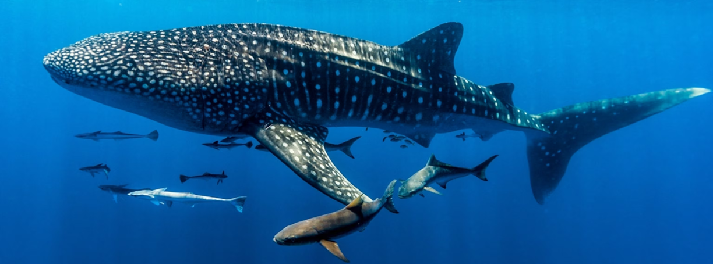 |

<br>

<a id="session2"></a>

#### Structure of satellite tag data {.tabset .tabset-fade .tabset-pills}

<br>

Satellite tracking of sharks has revolutionized our understanding of these marine predators. By harnessing advanced satellite technology and 
specialised tagging devices, researchers can monitor the movements, behaviors, and migratory patterns of various shark species with unprecedented precision.
This invaluable tool not only sheds light on the ecological roles of sharks but also contributes to their conservation by identifying critical habitats, 
migration routes, and overlap with potential threats. Satellite tracking plays a pivotal role in bridging the gap between scientific knowledge and 
effective shark conservation efforts in our oceans. Not all satellite tracking devices work the same way. In marine research, there are three main types of
tags used to track sharks and rays, and each come with their own data structure:


------------------------------------------------------------------------------------------------------------------------------------------------------

##### ARGOS tags 

<br>

<style>
div.blue { background-color:#e6f0ff; border-radius: 5px; padding: 20px;}
</style>
<div class = "blue">

::: {style="display: grid; grid-template-columns: 2fr 1fr; grid-column-gap: 60px;"}
<div>

ARGOS (Advanced Research and Global Observation Satellite) tags are essential tools for tracking sharks in the vast expanse of the world's oceans. These tags 
estimate a shark's position by receiving signals from a network of ARGOS satellites orbiting the Earth. Each ARGOS tag is equipped with a transmitter that 
periodically sends out signals containing the tag's unique identification number and other data. When the tag's signals reach an ARGOS satellite passing 
overhead, the satellite records the time and location of the signal reception. By using the Doppler effect of frequency of the transmitted signal vs the 
received signal (from multiple satellites), the ARGOS system calculates the tag's position with a certain degree of accuracy. This position estimate is 
then relayed to researchers on the ground, providing valuable data about the shark's whereabouts, including latitude and longitude coordinates. While ARGOS 
tags offer global coverage, they may have limitations in terms of location accuracy compared to GPS tags and rely on animals coming up to the surface 
regularly, making them more suitable for tracking sharks with broader ranges and less need for high precision. Often ARGOS tags are also combined with 
GPS transmitters to supplement the positional data with higher accuracy information.

</div>

<div>

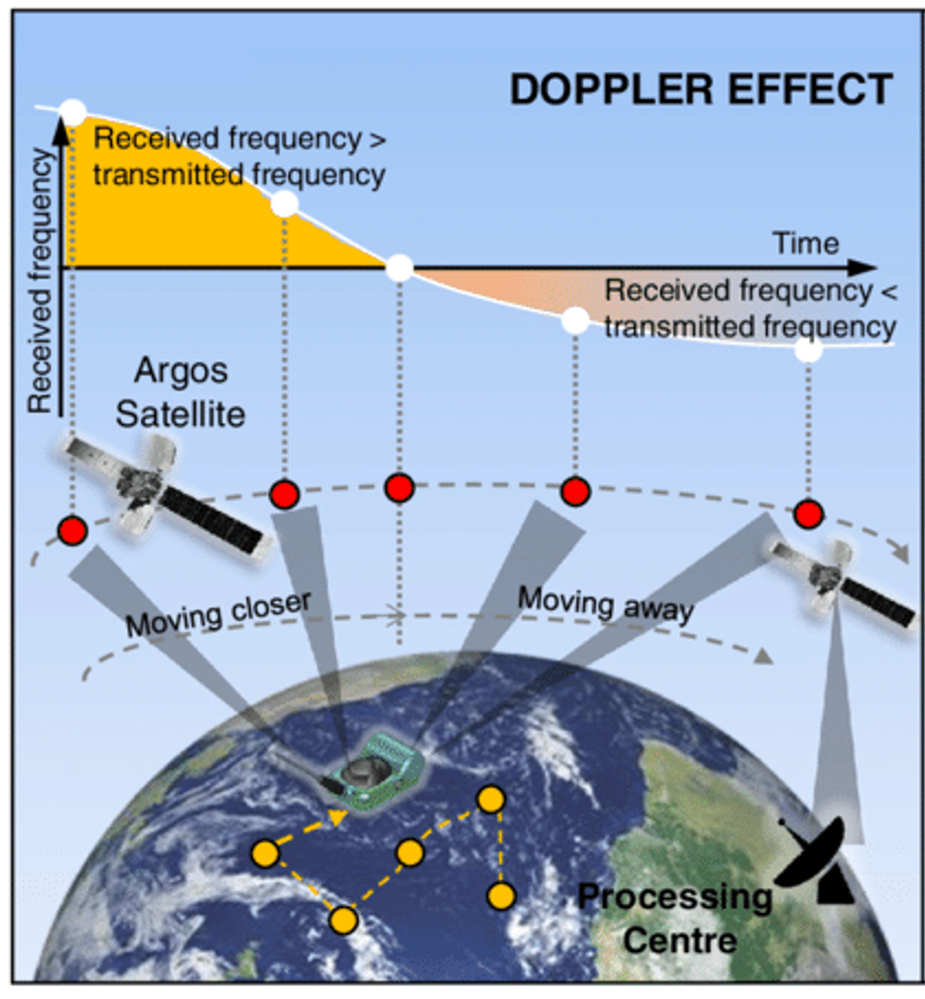

</div>
:::


::: {style="display: grid; grid-template-columns: 1fr 1fr; grid-column-gap: 60px;"}
<div>

Raw ARGOS data are often pre-processed using a number of algorithms like Kalman filters and least squares methods to refine and define the accuracy of positional
data obtained from ARGOS tags. These advanced mathematical techniques allow us to correct and improve the accuracy of the initial estimates provided by the ARGOS
system. Kalman filters, for instance, model the movement of the tagged animal over time, incorporating factors like ocean currents and atmospheric conditions to 
produce more reliable position estimates. Least squares methods minimize the discrepancy between observed ARGOS positions and expected positions based on the animals
known characteristics. Once filtered, each estimated position is associated with a specific 'Location Class' that are either 3, 2, 1, 0, A, B, Z (and G if GPS data
is included).

</div>

<div>

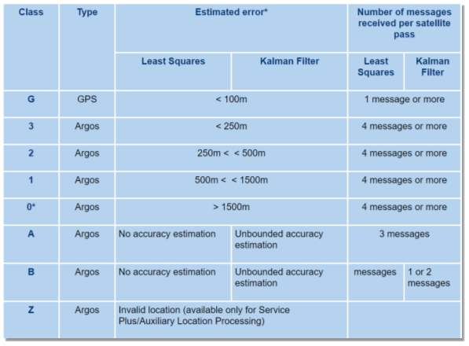

</div>
:::

</div>

<br>

**Data structure:**

The structure for data obtained using ARGOS devices after running it through a post-processing filter includes: **tag ID (often PTT), date and time of detection,** 
**estimated latitude, estimated longitude, location class of estimated error**; if the data has been processed using a Kalman filter, the error is defined
by additinal variables including **error radius, semi-major axis, semi-minor axis, ellipse orientation.** Tags used in marine tracking also collect additional
environmental data including **depth and water temperature**, and can be set to collect other biological data including (but not limited to) **acceleration**.

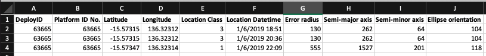

<br>

------------------------------------------------------------------------------------------------------------------------------------------------------

[Back to top](#session2)

<br><br>

##### GPS tags

<br>

<style>
div.blue { background-color:#e6f0ff; border-radius: 5px; padding: 20px;}
</style>
<div class = "blue">

::: {style="display: grid; grid-template-columns: 2fr 1fr; grid-column-gap: 60px;"}
<div>

GPS (Global Position System) tags are invaluable for accurately determining the positions of tracked sharks and rays. These tags rely on a constellation of GPS 
satellites orbiting the Earth. Each GPS tag is equipped with a GPS receiver that constantly listens for signals from multiple GPS satellites. By measuring the 
time it takes for signals to reach the tag from different satellites, the tag can calculate its precise latitude and longitude coordinates. GPS tags provide 
real-time, high-resolution location data, making them ideal for tracking sharks with fine-scale movements or those inhabiting nearshore environments. This 
technology enables researchers to monitor a shark's every move, from its foraging behavior to its migration patterns, with a level of detail that is unmatched
by other tracking methods. GPS tags are particularly valuable for understanding the spatial ecology of coastal and territorial sharks. Again, like the ARGOS tags 
these tags also rely on animals coming up to the surface regularly, and are more suitable for tracking non-benthic or pelagic species. Like with ARGOS tags, GPS
tags are often also paired with other technologies (e.g., GSM mobile phone technology) to increase spatial coverage and increase battery life of tags.

</div>

<div>
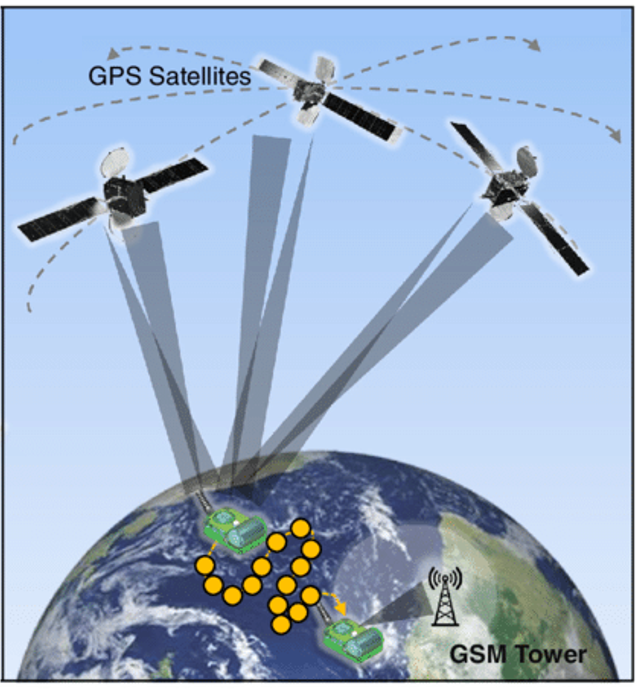
</div>
:::

</div>

<br>

**Data structure:**

The structure for data obtained using GPS devices is a lot more simpler than other formats and often includes at the least: **tag ID (often PTT), date and time**
**of detection, estimated latitude, estimated longitude**. Like with ARGOS tags, GPS tags for marine research also often collect a range of environmental data
including **depth and water temperature**, and can be set to collect other biological data including (but not limited to) **acceleration**.

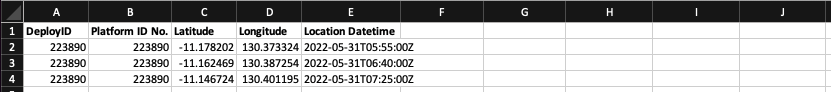

<br>

------------------------------------------------------------------------------------------------------------------------------------------------------

[Back to top](#session2)

<br><br>

##### GLS tags

<br>

<style>
div.blue { background-color:#e6f0ff; border-radius: 5px; padding: 20px;}
</style>
<div class = "blue">

::: {style="display: grid; grid-template-columns: 1.5fr 1fr; grid-column-gap: 60px;"}
<div>

GLS (Geolocation sensor) tags are a specialized tracking tags that estimates a tagged animals position based on the timing of natural light patterns, specifically 
sunrise and sunset (learn more about how GLS analyses [here]( https://doi.org/10.1111/1365-2656.13036)). These tags are often used for tracking oceanic and pelagic
sharks that roam over vast distances, but are also useful for benthic species that don't surface frequently. A GLS tag is equipped with light sensors that record 
the daily variations in ambient light levels. By analyzing the timing and duration of these light patterns, the tag can estimate the shark's latitude and longitude.
The estimation of coordinates from GLS tags are done using one of two methods:

1. Threshold methods: use two successive twilight events (the times at which the recorded light level crosses a predetermined threshold) to produce a 
location estimate.
2. Curve-fitting methods: use rate of change in light level during the twilight period to derive a location estimate using a single twilight.

<br>

In GLS tags used in marine environments, the light data is also supplimented by the tag collecting light attenuation with depth to provide more accurate estimates 
of twighlight. Light geolocator methods have large errors in location estimates. GLS tags do not provide real-time location data and are generally less accurate 
than GPS tags. Nevertheless, they are suitable for more benthic species or sharks and rays that may not tolerate larger, more intrusive tags, and they have contributed 
significantly to our understanding of long-distance migrations and seasonal behaviors. Like the ARGOS and GPS tags, GLS tags in shark research are often packaged
with other sensors (e.g., temperature, pressure, accelerometers) to transmit more information on the animal's environment, and are often deployed on timed releases
to detach from the tagged animal before transmitting information back to the researchers.

</div>

<div>

<br><br>

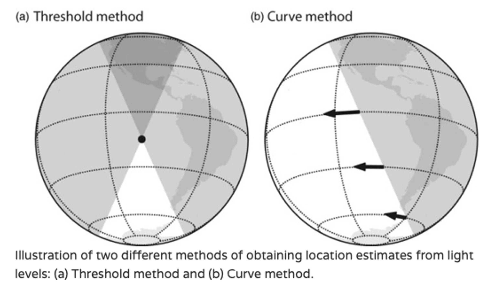

<br><br><br><br><br>

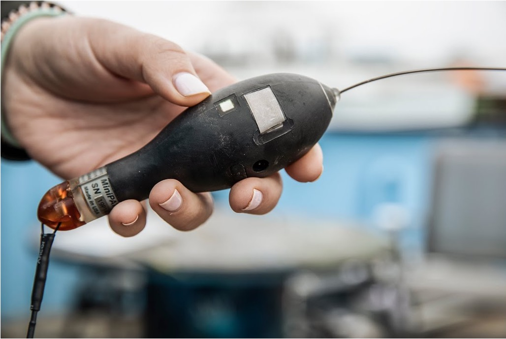

</div>
:::

</div>

<br>

**Data structure:**

GLS tag data need to be processed to estimate most likely coordinates based on the light data. In most cases, tag manufacturers provide their own post-processing
software (e.g., [Wildlife Computers GPE3 algorithm](https://wildlifecomputers.com/blog/using-gpe3-to-improve-geolocation-estimates/)). These software often use
state-space or maximum likelihood algorithms to improve the estimation of locations based on other data collected by the tag (i.e., *water temperature, depth,*
*deployment and pop-off location, ARGOS/GPS based positional data*). The software uses the combination of light, maximum depth, water temperature, and any other 
positional data provided to compare with known bathymetry and seasonal temperature maps in the region of the study site. This process helps improve estimated
coordinates, and provides a measure or error for each estimated location.

The structure for data obtained using GLS devices after running it through a post-processing software includes: **tag ID (often PTT), date and time of estimated location,** 
**estimated latitude, estimated longitude, error in latitudinal estimate and longitudinal estimate**. The tags used in marine tracking will also collect and transmit
environmental data including **depth and water temperature**, and can be set to collect other biological data including (but not limited to) **acceleration**.

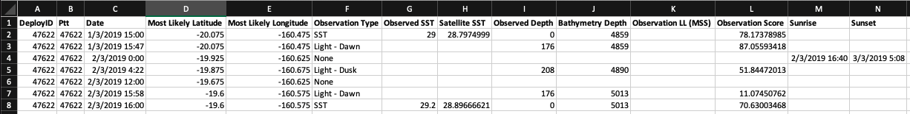

<br>

------------------------------------------------------------------------------------------------------------------------------------------------------

[Back to top](#session2)

<br><br>

#### Processing and visualising satellite tag data using ***aniMotum***

<br>

In this session we will work with a small subset of tracking data collected by Brad Norman and his team at [ECOCEAN](https://whaleshark.org.au). The data 
consists of tracking data from two Whale Sharks (*Rhincodon typus*) tagged with ARGOS tags at the Thaa Atoll, the Maldives, in 2017. The data shows the 
large oceanic dispersal these species conduct across the Indian Ocean. The data have been processed using a Least-Squares algorithm, and each position
has an estimated error expressed as an ARGOS location class (see previous section for details on each location class). The full dataset can be found on
this [ZoaTrack repository](https://zoatrack.org/projects/402). We will use this dataset to further refine positions, and predict positions at regular 
intervals, and calculate measures of movement to get some insight into the behaviours of the two individuals.

<br>

[**You can download the dataset we will use for this session from [here](https://github.com/vinayudyawer/SEA-workshop2023/raw/main/data/Session%202.zip).**]{style="color:firebrick"}
[**The link should download a zip file with one .csv file that we will use during this session.**]{style="color:firebrick"}

<br>

```{r, echo=FALSE, message=FALSE, include=TRUE, out.width = '100%'}
library(tidyverse)
library(sf)
library(mapview)
library(leaflet)

tagdat <- 
  read_csv('https://raw.githubusercontent.com/vinayudyawer/SEA-workshop2023/main/data/Session%202/Thaa_Whalesharks_ECOCEAN.csv') %>% 
  st_as_sf(coords = c("Longitude", "Latitude"), crs = 4326)

path <-
  tagdat %>% 
  group_by(DeployID) %>% 
  summarise(do_union = FALSE) %>% 
  st_cast("LINESTRING")

m_130 <-
  mapview(path %>% filter(DeployID %in% "M-130"), alpha = 1, color = "white", homebutton = F, legend = F, map.type = c("Esri.NatGeoWorldMap"), layer.name = "M-130") +
  mapview(tagdat %>% filter(DeployID %in% "M-130"), alpha.regions = 1, alpha = 0, col.regions = "white", homebutton = F, legend = F, cex = 3, layer.name = "M-130") +
  mapview(tagdat %>% filter(DeployID %in% "M-130") %>% slice(1), alpha.regions = 1, alpha = 0, col.regions = "darkgreen", homebutton = F, legend = F, layer.name = "M-130") +
  mapview(tagdat %>% filter(DeployID %in% "M-130") %>% slice(n()), alpha.regions = 1, alpha = 0, col.regions = "firebrick", homebutton = F, legend = F, layer.name = "M-130")

m_150 <-
  mapview(path %>% filter(DeployID %in% "M-150"), alpha = 1, color = "white", homebutton = F, legend = F, map.type = c("Esri.NatGeoWorldMap"), layer.name = "M-150") +
  mapview(tagdat %>% filter(DeployID %in% "M-150"), alpha.regions = 1, alpha = 0, col.regions = "white", homebutton = F, legend = F, cex = 3, layer.name = "M-150") +
  mapview(tagdat %>% filter(DeployID %in% "M-150") %>% slice(1), alpha.regions = 1, alpha = 0, col.regions = "darkgreen", homebutton = F, legend = F, layer.name = "M-150") +
  mapview(tagdat %>% filter(DeployID %in% "M-150") %>% slice(n()), alpha.regions = 1, alpha = 0, col.regions = "firebrick", homebutton = F, legend = F, layer.name = "M-150")
  
(m_130 + m_150)@map %>% 
  addLayersControl(
        # overlayGroups = c("Esri.NatGeoWorldMap","Esri.WorldImagery"),
        baseGroups = c("M-130", "M-150"),
        options = layersControlOptions(collapsed = FALSE))


```

<br>

::: {style="display: grid; grid-template-columns: 1fr 2fr; grid-column-gap: 60px;"}
<div>

We will use the [***aniMotum***](https://github.com/ianjonsen/aniMotum) package developed by Dr. Ian Jonsen. This package provides a quick and easy
means to refine positions by integrating the error associated with location data, and modelling the data to be able to predict locations at fixed
intervals. The package also provides a means to explore potential movement behaviours using the characteristics of the track. For more details on
the package you can explore the vignettes provided with the package, and also explore its applications in this [paper](https://doi.org/10.1111/2041-210X.14060).

<br>

The package has a clear workflow, and we can walk through the first 4 steps to process and visualise our data:

<br>

1. Modify our data to the expected input format

2. Choose and fit an appropriate state-space movement process model

3. Check our model fit

4. Visualise our model estimates

</div>

<div>

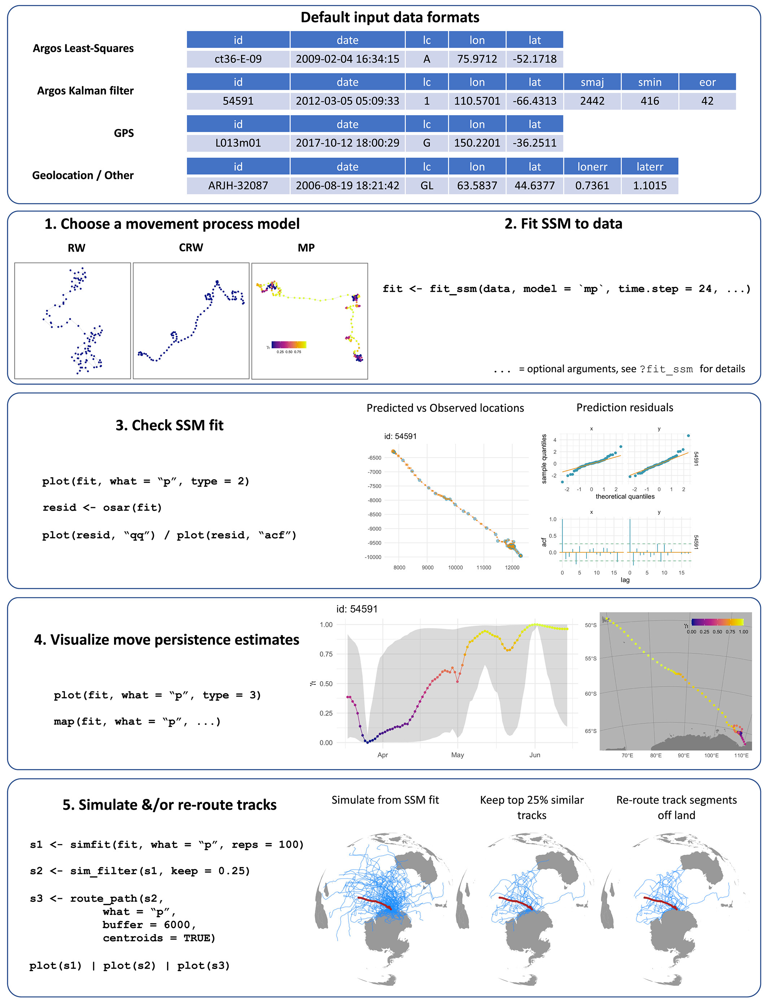

</div>
:::

<br><br>

##### Step 1: Input and format data

------------------------------------------------------------------------------------------------------------------------------------------------------

Lets begin our data processing by first reading in the data, and formatting it so that the package can read it properly:

```{r, message=FALSE, warning=FALSE}

library(tidyverse)
library(aniMotum)

raw_data <- 
  read_csv('https://raw.githubusercontent.com/vinayudyawer/SEA-workshop2023/main/data/Session%202/Thaa_Whalesharks_ECOCEAN.csv')

head(raw_data)

## Now lets format the data using transmute() so aniMotum can read it properly

tagdat <-
  raw_data %>% 
  transmute(id = DeployID,
            date = Loc.DateTime,
            lc = Loc.Class,
            lon = Longitude,
            lat = Latitude)

head(tagdat)

```

<br>

Lets have a closer look at the data, and understand what the positional error in our data look like. We can do this quickly by plotting some maps
or figures to assess where our positions are more accurate, and where they are not.

```{r, message=FALSE, fig.align='center'}
## Lets look at what proportion of our positional data are within each location class

tagdat %>% 
  group_by(id, lc) %>% 
  summarise(num_pos = n()) %>% 
  ggplot(aes(x = id, y = num_pos, fill = lc)) +
  geom_col(position = "fill") +
  labs(x = "Tag ID", y = "Proportion of fixes", fill = "Location\nClass") +
  theme_bw()

```

It looks like a large proportion of our data have low accuracy position estimates (Location Classes A and B). This is often the same in many tracking
studies. At this stage, we can make a decision on if we want to subset our tracking data to only include certain Location Classes, to make sure our
positional data are accurate. However another way to get more accurate positions and retain as much data as possible, is to model the data with the 
estimated error to predict more accurate positions.

<br><br>

##### Step 2: Choose and fit a movement model

------------------------------------------------------------------------------------------------------------------------------------------------------

Lets try and retain as much data as we can and move onto the second step; choosing and fitting a movement model. This step allows us to model
the data we have, and gives us the ability to then predict positions along the animals movement path to produce positions at fixed time periods. 
This becomes important when we want to calculate metrics of movements to help define movement behaviours. There are three main movement processes
that `aniMotum` provides: 

1. **Random Walk (RW) models** - where movements between positions are modeled to be random in direction and magnitude.
2. **Correlated Random Walk (CRW) model** - where movements between positions are modeled as random and *correlated* in direction and magnitude.
3. **Continuous-time Move Persistence (MP) model** - where movements between positions are modeled as random with correlations in direction and magnitude that *vary in time*.

You can explore the specifics of this package from the vignette [here](https://ianjonsen.github.io/aniMotum/articles/Overview.html).

<br>

For our data, we will use the Continuous-time move persistence model ('mp' option in the code). We can run this model by simply using the `fit_ssm()`
function in `aniMotum`. The function requires some basic information on the dispersal ability of our study species. At the least, it asks for our
estimate of swimming speed of our animal. Whale sharks are pretty slow swimming sharks and their average speed has been measured to be about 
[1.5 m/s](https://www.wwf.org.uk/learn/fascinating-facts/whale-sharks). We can also use this function to predict positions at fixed time periods.
Here lets predict a position for each day of the tracking period. 

``` {r, eval = FALSE}
## Lets now now fit a Continuous-time Move Persistence (MP) model to our data

fit <-
  fit_ssm(x = tagdat, 
          vmax = 1.5, ## maximum speed of whale sharks (in m/s)
          model = "mp", ## Move persistence model
          time.step = 24) ## predict positions every 24 hours

```

<br>

Lets explore the outputs of our model next:

```{r, eval=TRUE, echo=FALSE}
fit <- read_rds("data/aniMotum_fit.RDS")
```
```{r, fig.align = 'center', fig.height = 3, fig.width = 10, message = FALSE}
## Lets have a look at the fitted component of the model 
## (original data, corrected by including positional error)

plot(fit, 
     what = "fitted", ## what component of the model to plot ('fitted', 'predicted' or 'rerouted')
     type = 2, ## type of plot to make
     pages = 1, 
     ncol = 2)

```

<br><br>

##### Step 3: Check model fit

------------------------------------------------------------------------------------------------------------------------------------------------------

As you can see, the model identified some positions that are outlier (x on the above plots). These are positions that do not fit within the
modeled movement process. The fitted positions have also 'corrected' some of the positions (in yellow above), and have plotted the original positions
in blue. We can next look at the predicted component of the model, and see how well the model fit the data, we use the `osar()` function for this:

```{r, eval=TRUE, echo=FALSE, message=FALSE}
resid <- read_rds("data/aniMotum_resid.RDS")
```
```{r, eval=FALSE}
## Lets check the model fit, and then see what the model predictions look like

resid <- osar(fit)
```
```{r, eval=TRUE, message=FALSE, fig.show="hold", out.width="50%"}
## Lets check our model fit for both tracks
plot(resid, type = "qq")
plot(resid, type = "acf")

```

<br><br>

We can also look at how closely the predicted positions compare to the 'corrected' fitted positions. This is often the best way to ascertain if the 
model you produced is a good fit. You can play around with the model parameters (e.g., `vmax`) to make sure the model represents the biology of the
animal you are tracking

```{r, message=FALSE, eval=TRUE, fig.align = 'center', fig.height = 3, fig.width = 10}

plot(fit, 
     what = "predicted", 
     type = 2,
     pages = 1,
     ncol = 2)


```

<br><br>

##### Step 4: Visualise movement model estimates

------------------------------------------------------------------------------------------------------------------------------------------------------

Since we ran the 'mp' model, we also have values of move persistence for each predicted location. **Move persistence ($\gamma_t$)** is an index of movement behaviour
and is a continuous value between 0 - 1. The value represents changes in movement pattern for that individual based on autocorrelation in speed and
direction (see details [here](https://doi.org/10.1002/ecy.2566)). We can look at the patterns in this metric for each tracked individual spatially
and over the tracking period. Lower $\gamma_t$ values are related to slower movements that are often associated with *area restricted searching* behaviours often
associated with foraging, with higher $\gamma_t$ values representing more linear movements that are associated with *migratory* behaviours.

```{r, message=FALSE, eval=FALSE}

plot(fit, 
     what = "predicted", 
     type = 3,
     pages = 1,
     ncol = 2,
     normalise = TRUE)

plot(fit, 
     what = "predicted", 
     type = 4,
     pages = 1,
     ncol = 2,
     normalise = TRUE)

```
```{r, message=FALSE, eval=TRUE, echo = F, fig.align = 'center', fig.height = 3, fig.width = 10}

plot(fit, 
     what = "predicted", 
     type = 3,
     pages = 1,
     ncol = 2,
     normalise = TRUE)

plot(fit, 
     what = "predicted", 
     type = 4,
     pages = 1,
     ncol = 2,
     normalise = TRUE)


```

<br>

We can use the `grab()` function to extract specific components of the model output to have a closer look at them, or produce your own maps using
the other packages we have covered here like `ggspatial` and `mapview`. The `grab()` function also allows users to extract the positional data as a `sf` object
and makes it so easy to them plot them using other packages.

```{r, out.width = '100%', message=FALSE, warning=FALSE}
## Lets plot our own version of the predicted component using mapview

pred_data <- grab(fit, 
                  what = "predicted", 
                  as_sf = TRUE, 
                  normalise = TRUE)

## Lets convert the point dataset into a path using the `sf` package

library(sf)

pred_path <- 
  pred_data %>% 
  group_by(id) %>% 
  summarise(do_union = FALSE) %>% 
  st_cast("LINESTRING")

## Now lets plot a nice interactive plot of the move persistence data using `mapview` and 'leaflet'

library(mapview)
library(leaflet)

color_palette <- colorRampPalette(hcl.colors(10, palette = "Reds 3"))

m_130 <-
  mapview(pred_path %>% filter(id %in% "M-130"), alpha = 1, color = "white", homebutton = F, 
          legend = F, map.type = c("Esri.WorldImagery"), layer.name = "M-130") +
  mapview(pred_data %>% filter(id %in% "M-130"), alpha.regions = 1, alpha = 0, zcol = "g",
          homebutton = F, legend = F, cex = 3, layer.name = "M-130", col.regions = color_palette(100)) +
  mapview(pred_data %>% filter(id %in% "M-130") %>% slice(1), alpha.regions = 1, alpha = 0,
          col.regions = "darkgreen", homebutton = F, legend = F, layer.name = "M-130") +
  mapview(pred_data %>% filter(id %in% "M-130") %>% slice(n()), alpha.regions = 1, alpha = 0,
          col.regions = "firebrick", homebutton = F, legend = F, layer.name = "M-130")

m_150 <-
  mapview(pred_path %>% filter(id %in% "M-150"), alpha = 1, color = "white", homebutton = F, 
          legend = F, map.type = c("Esri.WorldImagery"), layer.name = "M-150") +
  mapview(pred_data %>% filter(id %in% "M-150"), alpha.regions = 1, alpha = 0, zcol = "g",
          homebutton = F, legend = F, cex = 3, layer.name = "M-150", col.regions = color_palette(100)) +
  mapview(pred_data %>% filter(id %in% "M-150") %>% slice(1), alpha.regions = 1, alpha = 0,
          col.regions = "darkgreen", homebutton = F, legend = F, layer.name = "M-150") +
  mapview(pred_data %>% filter(id %in% "M-150") %>% slice(n()), alpha.regions = 1, alpha = 0,
          col.regions = "firebrick", homebutton = F, legend = F, layer.name = "M-150")

mm <- 
(m_130 + m_150)@map %>% 
  addLayersControl(
        baseGroups = c("M-130", "M-150"),
        options = layersControlOptions(collapsed = FALSE)) %>% 
  addLegend(colors = color_palette(11), 
            labels = round(seq(0, 1, by = 0.1), 2),
            title = "g", opacity = 1)

mm

```

<br>
<style>
div.blue { background-color:#e6f0ff; border-radius: 5px; padding: 20px;}
</style>
<div class = "blue">

##### *Additional steps*

The `aniMotum` package also allows users to use your fitted model to simulate similar tracks. This becomes very useful if you want to compare your
animals track with other 'null' models. This allows for further hypothesis testing and analyses like resource selection functions. We won't go over
this last step here, but you can read more about it from this [vignette](https://ianjonsen.github.io/aniMotum/articles/Track_simulation.html).

Similarly, the package also allows users to adjust the predicted tracks produced to be re-routed around landmasses. This is extremely useful when working 
with marine animal tracking. We wont go over this here as our example dataset represent Whale sharks primarily moving across open oceans. You can find
more information and examples of how to use the path re-routing workflow from this [vignette](https://ianjonsen.github.io/aniMotum/articles/Path_rerouting.html).
Now that you have a predicted track, you can also use a range of other packages to create animations of movements (e.g., [gganimate](https://gganimate.com)), 
and explore 3D animal space use if depth data was also collected (e.g., [KUD3D](https://github.com/vinayudyawer/KUD3D) and [rayshader](https://www.rayshader.com)).

</div>

------------------------------------------------------------------------------------------------------------------------------------------------------

<a href="#top" style="color:steelblue; font:bold;" >Back to top</a>

<br><br>

## Session 3

### Working with passive acoustic telemetry data

|                           |
|:--------------------------|
|  |

<br>

Acoustic telemetry refers to tracking the movements of aquatic animals using high frequency sound pulses as an encoded signal. It typically involves two 
pieces of equipment: 1) a transmitter or tag attached to the animal to be tracked, and 2) a receiver or listening station deployed at key locations and habitats,
which records the presence of the tagged animal whenever it is within range (~200 – 800 m in most cases). 

Acoustic Telemetry makes it possible for multiple animals to be monitored over long periods of time, and over scales of 100s of metres to 100s of kilometres.
Information obtained from acoustic telemetry can inform habitat use, home range size, effectiveness of marine protected areas, refinement of stock assessment,
and migratory patterns.

<br>

<div class="text-toggle">
<button onclick="toggleText()">Click here to learn more about Acoustic Telemetry</button>
<div id="hidden-text">

<style>
div.blue { background-color:#e6f0ff; border-radius: 5px; padding: 20px;}
</style>
<div class = "blue">

#### A two-part system {.tabset .tabset-fade .tabset-pills}

##### Acoustic transmitters


<br>

Tracking the movement of animals involves affixing special tags to individuals that are being monitored. These tags, called acoustic transmitters, transmit high
frequency acoustic signals that include a unique animal ID. Transmitters with sensors also transmit sensor data that may include temperature, pressure (depth) or
acceleration. Long-term passive monitoring primarily uses coded tags that use a communication system called Pulse Position Modulation (PPM). This system works 
where tags transmit a sequence of coded pulses.

::: {style="display: grid; grid-template-columns: 1.5fr 1fr; grid-column-gap: 50px;"}

<div>

Acoustic transmitters have been developed and commercially produced by a number of manufacturers. One manufacturer that has developed this technology within Australia
and Asia is [Innovasea](https://www.innovasea.com/fish-tracking/), however there are a range of other manufacturers that produce similar tracking technologies. 
Transmitters developed by Innovasea range in size from 15 - 98mm, with the largest tags having a battery life of 10 years. Depending on the size, shape and behaviour 
of the study species, transmitters can be attached to individuals by conducting a minor surgical procedure. Larger animals, or animals difficult to handle can also be
tagged externally using transmitters tethered to specialised dart tags. 

</div>

<div>

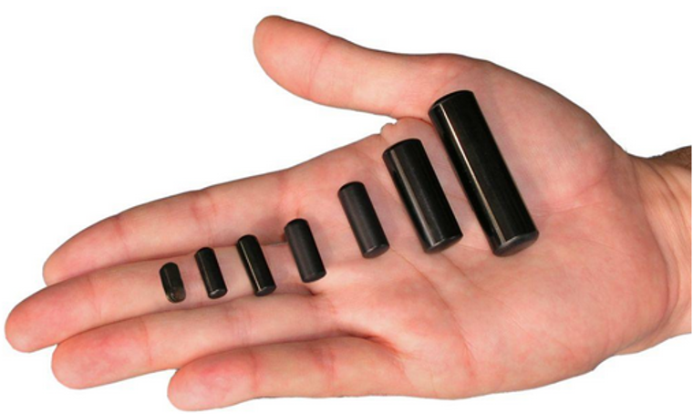 

</div>

:::

 

##### Acoustic Receivers


<br>

The second part of this system are hydrophone data loggers called ‘acoustic receivers' or 'listening stations’. These receivers record the unique animal ID
transmitted by the tag, any sensor data and a timestamp when a tagged animal fitted is within detection range of a receiver. The detection range of a receiver
depends on a range of factors, that can vary through time and depending on the deployment location. More information on detection range can be found  [here](https://support.vemco.com/s/article/How-much-detection-range-can-I-expect-from-my-tags-and-receivers) and [here](https://doi.org/10.1111/2041-210X.12520).

::: {style="display: grid; grid-template-columns: 1fr 2fr; grid-column-gap: 40px;"}

<div>

<br>


<br>

</div>

<div>

<br>

In most cases, multiple receivers (termed an ‘array’) are deployed at fixed locations around a study site, for the full period of the study (i.e., seasons, years),
and allow for long-term continuous monitoring. The design of the receiver array depends on the question being explored, the animals being tracked, or the habitats 
within the study site. [Heupel et al. 2006](https://doi.org/10.1071/MF05091) provides a good review of possible designs of acoustic arrays, including grids and curtains,
to track marine animals.
<br>
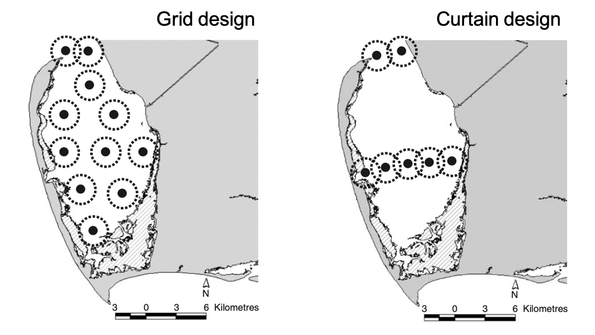

</div>

:::

</div>

</div>
</div>

<br>

------------------------------------------------------------------------------------------------------------------------------------------------------

<br>

In this session we will go through a brief walk through of how we can use the `VTrack` R package to quickly format and analyse large acoustic tracking
datasets. A lot of the functions here do similar analyses to the ones you learned in the previous session. We will then go through a new R package
called `remora` that helps users to interactively explore their data as well as append environmental data to detections to further your analysis
of animal movements. Here we are just arming you with multiple tools to be able to analyse your data. Which analysis (and thus R package) is more appropriate
and suitable to your dataset will depend on your study design, research questions and data available. 

<br>

[**You can download the dataset we will use for this session from [here](https://github.com/vinayudyawer/SEA-workshop2023/raw/main/data/Session%203.zip).**]{style="color:firebrick"}
[**The link should download a zip file with four .csv files that we will use during this session.**]{style="color:firebrick"}

<br>

<a id="session3"></a>

#### {.tabset .tabset-fade}

##### Structure of acoustic telemetry data {.tabset .tabset-fade .tabset-pills}

Currently there are several data management tools that are extremely useful in storing, cleaning, exploring and analysing data obtained using Acoustic
Telemetry. One that everyone here may be familiar with is the ***VUE*** software that you have been using to communicate with Innovasea receivers
to offload and store data. In addition to software, several online data repositories exist to store and share acoustic telemetry data. The 
[Australian Animal Acoustic Telemetry Database](https://animaltracking.aodn.org.au) houses acoustic telemetry datasets collected 
in Australia and users can store and access acoustic telemetry data through the database. Each data source have their own data export formats, which are 
not always interchangeable when using with **R** packages. 

In general, acoustic telemetry datasets have at least 3 components that are required for analyses:

1.  **Detection data:** This includes the only the presence of tagged individuals on specific receivers.
2.  **Transmitter metadata:** This includes metadata information on the tag specifications. Sometimes this also includes metadata of the animal
    tagged.
3.  **Acoustic array metadata:** This includes coordinates of all the recievers used to monitor tagged animals in the study system.

<br>

Here we will go through 2 different formats that acoustic telemetry data can come in, and how each are structured. This is not an extensive list, but
just includes the main formats currently used by software and expected by R packages.

<br>

------------------------------------------------------------------------------------------------------------------------------------------------------

###### VUE format

Exporting detection data from VUE provides only a single file. This includes only the detection data. The researcher is responsible to keep metadata
for each receiver within the array and tag deployment, which are also needed for a full analysis.

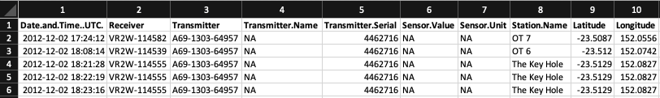 

<br>

------------------------------------------------------------------------------------------------------------------------------------------------------

[Back to top](#session3)

<br><br>

###### Australian Animal Acoustic Telemetry format

Detection data exported from the [Australian Animal Acoustic Telemetry Database](https://animaltracking.aodn.org.au) has its own format. The database
website allows reasearchers to access and download detection, tag metadata and receiver metadata for a selected tagging project. This data export have
a large number of columns that provide a comprehensive information associated with each detection, tag or receiver. The format of the detection data
include the following 32 column names:

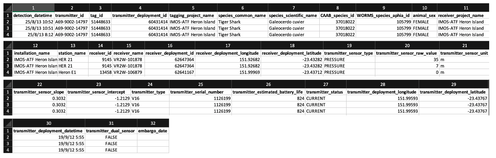

The database webpage also allows users to download complementary receiver metadata that has 15 columns:

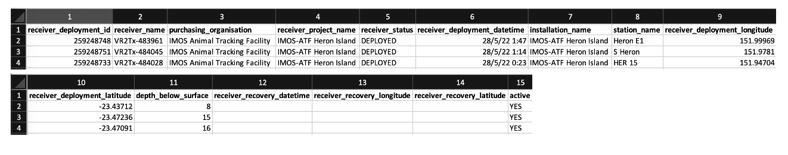

As well as tag metadata with 24 columns:

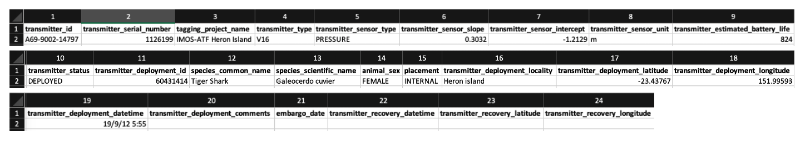

If size and other biological variables were collected for individuals (can be multiple measures) and additional `animal measures` file can be
downloaded:

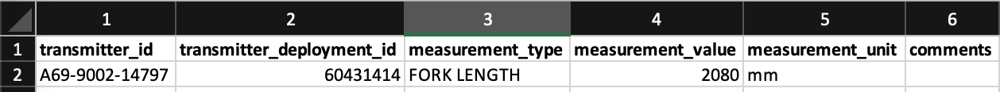 

<br>

------------------------------------------------------------------------------------------------------------------------------------------------------

[Back to top](#session3)

<br><br>


##### Explore patterns of detection with ***VTrack***

<br>

The **VTrack** package can be downloaded from GitHub. As we only have a short time for this session, I will only go over this briefly. If you want to
have a more comprehensive walk through of **VTrack**, go through the examples on [this page](https://vinayudyawer.github.io/ATT/docs/ATT_Vignette.html).
   

```{r, eval = FALSE}
## Load other useful packages
library(VTrack)
library(tidyverse)
library(lubridate)
library(sf)
library(mapview)

```

<br>

**Input, explore and format data from IMOS repository to use in** ***VTrack***

------------------------------------------------------------------------------------------------------------------------------------------------------

Lets have a look at the detection, tag and receiver/station metadata in R using the tidyverse.

```{r, eval = FALSE}

detections <- 
  read_csv('https://raw.githubusercontent.com/vinayudyawer/SEA-workshop2023/main/data/Session%203/IMOS_detections.csv')

tag_metadata <- 
  read_csv('https://raw.githubusercontent.com/vinayudyawer/SEA-workshop2023/main/data/Session%203/IMOS_transmitter_deployment_metadata.csv') %>% 
  left_join(read_csv('https://raw.githubusercontent.com/vinayudyawer/SEA-workshop2023/main/data/Session%203/IMOS_animal_measurements.csv'))
      
station_info <- 
  read_csv('https://raw.githubusercontent.com/vinayudyawer/SEA-workshop2023/main/data/Session%203/IMOS_receiver_deployment_metadata.csv')

```

<br>

We will then format it so that `VTrack` can read the column names correctly

```{r, eval = FALSE}
detections <-
  detections %>% 
  transmute(transmitter_id = transmitter_id,
            station_name = station_name,
            receiver_name = receiver_name,
            detection_timestamp = detection_datetime,
            longitude = receiver_deployment_longitude,
            latitude = receiver_deployment_latitude,
            sensor_value = transmitter_sensor_raw_value,
            sensor_unit = transmitter_sensor_unit)

tag_metadata <-
  tag_metadata %>% 
  transmute(tag_id = transmitter_deployment_id,
            transmitter_id = transmitter_id,
            scientific_name = species_scientific_name,
            common_name = species_common_name,
            tag_project_name = tagging_project_name,
            release_id = transmitter_deployment_id,
            release_latitude = transmitter_deployment_latitude,
            release_longitude = transmitter_deployment_longitude,
            ReleaseDate = transmitter_deployment_datetime,
            tag_expected_life_time_days = transmitter_estimated_battery_life,
            tag_status = transmitter_status,
            sex = animal_sex,
            measurement = measurement_value)

station_info <-
  station_info %>% 
  transmute(station_name = station_name,
            receiver_name = receiver_name,
            installation_name = installation_name,
            project_name = receiver_project_name,
            deploymentdatetime_timestamp = receiver_deployment_datetime,
            recoverydatetime_timestamp = receiver_recovery_datetime,
            station_latitude = receiver_deployment_latitude,
            station_longitude = receiver_deployment_longitude,
            status = active)

```

<br>

Explore these datasets and see if the columns line up with the correct data. We can now setup the data so that `VTrack` can then read and analyse
data properly

```{r, eval = FALSE}

input_data <- setupData(Tag.Detections = detections,
                        Tag.Metadata = tag_metadata,
                        Station.Information = station_info,
                        source = "IMOS",
                        crs = sp::CRS("EPSG:4326"))

summary(input_data)

```

<br>

The setup data is now a list containing all the components of data required for analyses. You can access each component separately by selecting each
component of the list

```{r, eval = FALSE}

input_data$Tag.Detections

input_data$Tag.Metadata

input_data$Station.Information

```


<br>

**Examine patterns in detection and dispersal**

------------------------------------------------------------------------------------------------------------------------------------------------------

We can start by creating simple detection plots and maps to look at patterns of detection and get more familiar with your data

```{r, eval = FALSE}
## use the VTrack function for a simple abacus plot
abacusPlot(input_data)

```
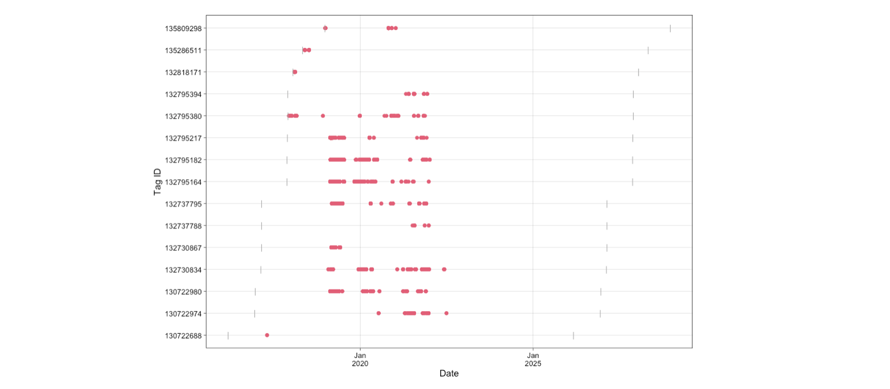

<br>

Instead of this simple output, you can also plot your own version of the abacus plot and include more details

```{r, eval = FALSE}
## plot your own!

combined_data <- 
  input_data$Tag.Detections %>% 
  left_join(input_data$Station.Information)

combined_data %>% 
  mutate(date = date(Date.Time)) %>% 
  group_by(Transmitter, Station.Name, date, Installation) %>% 
  summarise(num_detections = n()) %>% 
  ggplot(aes(x = date, y = Transmitter, size = num_detections, color = Installation)) +
  geom_point() +
  labs(size = "Number of Detections", color = "Installation Name") +
  theme_bw()

```

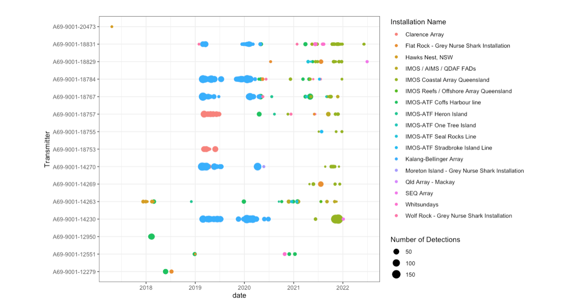

<br>

You can also map the data to explore spatial patterns

```{r, eval = FALSE}

## Map the data

combined_data %>% 
  group_by(Station.Name, Latitude, Longitude, Transmitter, Installation) %>% 
  summarise(num_detections = n()) %>% 
  st_as_sf(coords = c("Longitude", "Latitude"), crs = 4326) %>% 
  mapview(cex = "num_detections", zcol = "Installation")

```
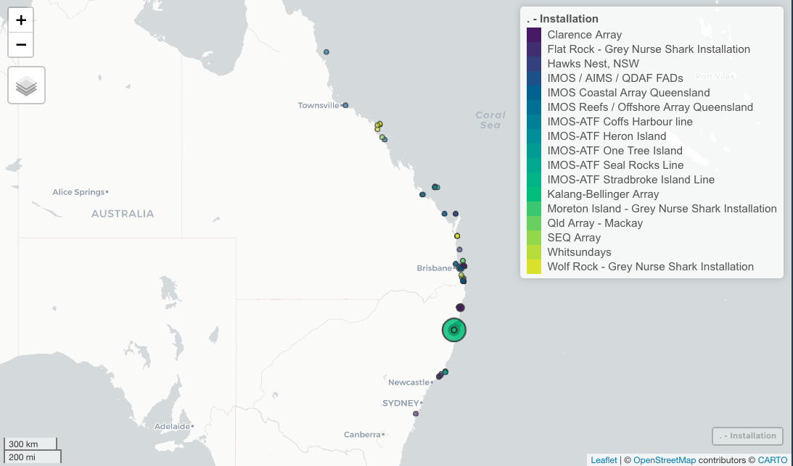


<br>

We can now use the `detectionSummary()` and `dispersalsSummary()` functions to calculate overall and monthly subsetted detection and dispersal
metrics

```{r, eval = FALSE}

## Summarise detections patterns

det_sum <- detectionSummary(ATTdata = input_data, sub = "%Y-%m")

summary(det_sum)

```

<br>

Here we have set the `sub` parameter to `%Y-%m` (monthly subset), weekly subsets can also be calculated using `%Y-%W`. The function calculates Overall
metrics as well as subsetted metrics, you can access them by selecting each component of the list output.

```{r, eval = FALSE}

det_sum$Overall

det_sum$Subsetted

```

<br>

We can then plot the results to have a look at monthly patterns in detection index between sexes of bull sharks tracked throughout the project

```{r, eval = FALSE}

monthly_detection_index <-
  det_sum$Subsetted %>% 
  mutate(date = lubridate::ymd(paste(subset, 01, "-")),
         month = month(date, label = T, abbr = T)) %>% 
  group_by(Sex, month) %>% 
  summarise(mean_DI = mean(Detection.Index),
            se_DI = sd(Detection.Index)/sqrt(n()))

monthly_detection_index %>% 
  ggplot(aes(x = month, y = mean_DI, group = Sex, color = Sex,
             ymin = mean_DI - se_DI, ymax = mean_DI + se_DI)) +
  geom_point() +
  geom_path() +
  geom_errorbar(width = 0.2) +
  labs(x = "Month of year", y = "Mean Detection Index") +
  theme_bw()
```     

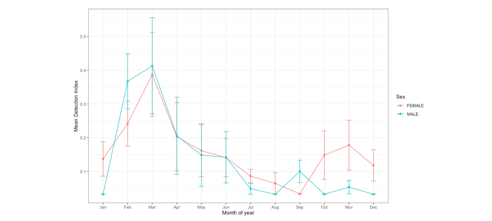
<br>

Similarly, we can use the `dispersalSummary()` function to do the same analysis to understand how dispersal distances moved by individuals change
over the year for each sex of bull shark.

```{r, eval = FALSE}

## Summarise dispersal patterns

disp_sum <- dispersalSummary(ATTdata = input_data)

disp_sum

monthly_dispersal <-
  disp_sum %>% 
  mutate(month = month(Date.Time, label = T, abbr = T)) %>% 
  group_by(Sex, month) %>% 
  summarise(mean_disp = mean(Consecutive.Dispersal),
            se_disp = sd(Consecutive.Dispersal)/sqrt(n()))

monthly_dispersal %>% 
  ggplot(aes(x = month, y = mean_disp, group = Sex, color = Sex,
             ymin = mean_disp - se_disp, ymax = mean_disp + se_disp)) +
  geom_point() +
  geom_path() +
  geom_errorbar(width = 0.2) +
  labs(x = "Month of year", y = "Mean Dispersal distance (m)") +
  theme_bw()

```     
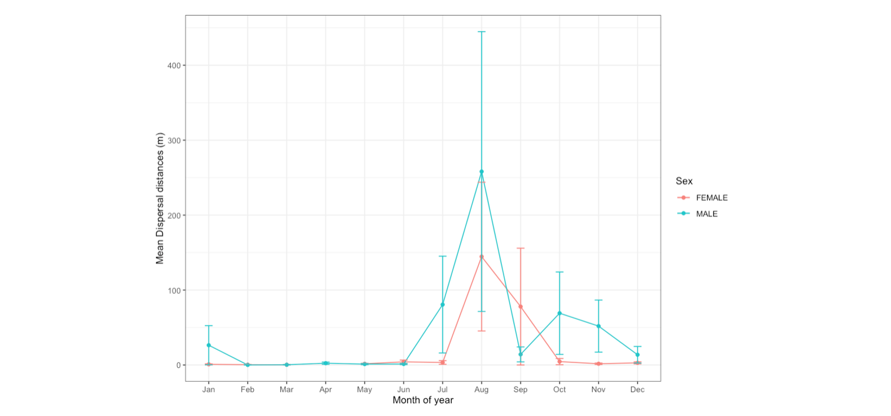
<br>

Like I mentioned above, since we have limited time to go through all the features of **VTrack** today, please go have a look
[here](https://vinayudyawer.github.io/ATT/docs/ATT_Vignette.html) to go through a more in-depth example of how the package can be used to calculate
and visualise activity space estimates for large acoustic telemetry datasets.

<br>

------------------------------------------------------------------------------------------------------------------------------------------------------

[Back to top](#session3)

<br><br>

##### Explore your data with ***re***mo***ra***

<br>

For this part of the session, we will go through some of the functionality of the new *re**mo**ra* package. This package was created to assist users of 
the [Australian Animal Acoustic Telemetry Database](https://animaltracking.aodn.org.au) to easily explore and analyse their data. The intention is that 
data exported and downloaded from the web portal can feed directly into the package to do quick analyses. The package also enables the integration of 
animal telemetry data with oceanographic observations collected by IMOS and other ocean observing programs. The package includes functiosn that: 

- Interactively explore animal movements in space and time from acoustic telemetry data
- Perform robust quality-control of acoustic telemetry data using the method described by [Hoenner et al. 2018](https://www.nature.com/articles/sdata2017206)
- Identify available remote sensed and sub-surface, in-situ oceanographic datasets that spatially and temporally overlap animal movement data
- Once identified, the package assists in extracting and appending these variables to the movement data

<br>

The package follows the following rough workflow to enable project reporting, data quality control and environmental data extraction:

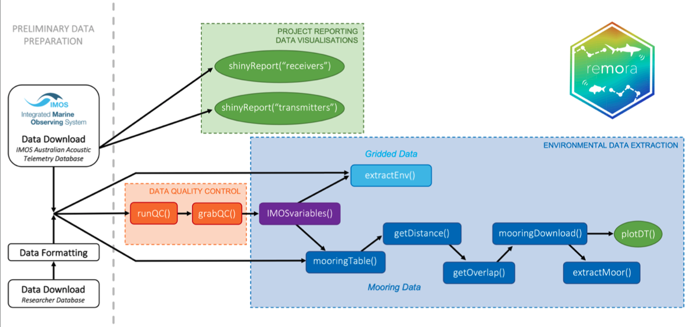

<br>

Today, due to limited time available, we will only go through one very useful aspect of the package; the **project reporting and data visualisation** functions.


```{r, eval = FALSE}

library(remora)

```

<br>

Once the package is loaded we can use one of the main functions of the package `shinyReport()` to interactively explore data. 

We can use this function to create a report based on your receiver data or transmitter data. Both these reports produce lots of interesting metrics and maps to explore your data in depth.

```{r, eval = FALSE}
## Create and explore a receiver array report
shinyReport(type = "receivers")

## Create and explore a transmitter report
shinyReport(type = "transmitters")
```

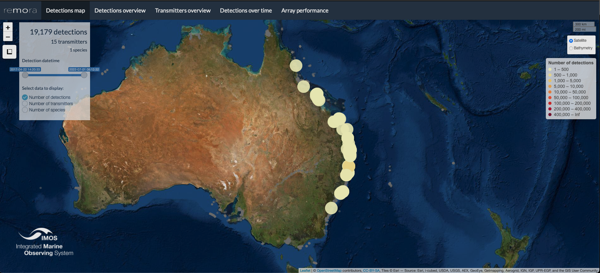

<br>

For more information on these functions check out the vignette in the remora package

```{r, eval = FALSE}
vignette("shinyReport_receivers", package = "remora")
vignette("shinyReport_transmitters", package = "remora")
```

<br>

Like some of the functions of *re**mo**ra* we have covered quickly above, there is far more functionality that we just dont have time to cover here. 
You can explore the full functionality of the package using vignettes that describe the different functions.

```{r, eval = FALSE}
browseVignettes(package = "remora")
```

<br><br>

------------------------------------------------------------------------------------------------------------------------------------------------------

**Signoff!**

This is where we end our R workshop! There may have been a few bits of code that you had trouble with or need more time to work through. We encourage
you to discuss these with me as well as others at the workshop to help get a handle on the R code.

<br>

If you have any comments or queries reguarding this workshop feel free to contact me:

-   Dr. Vinay Udyawer: [v.udyawer@aims.gov.au](mailto:v.udyawer@aims.gov.au){.email}

***Happy Tracking!***

------------------------------------------------------------------------------------------------------------------------------------------------------
<br>
